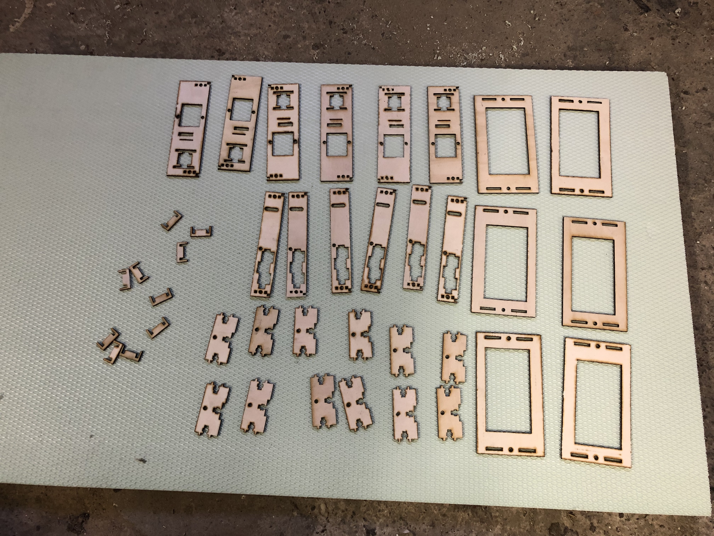
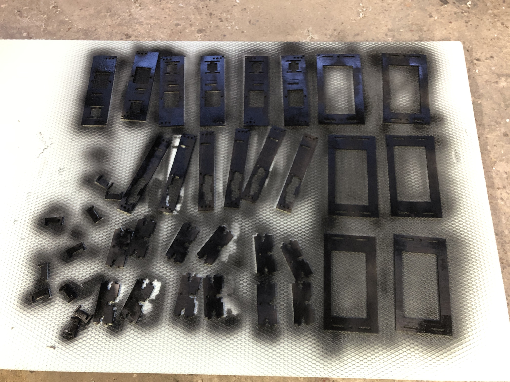
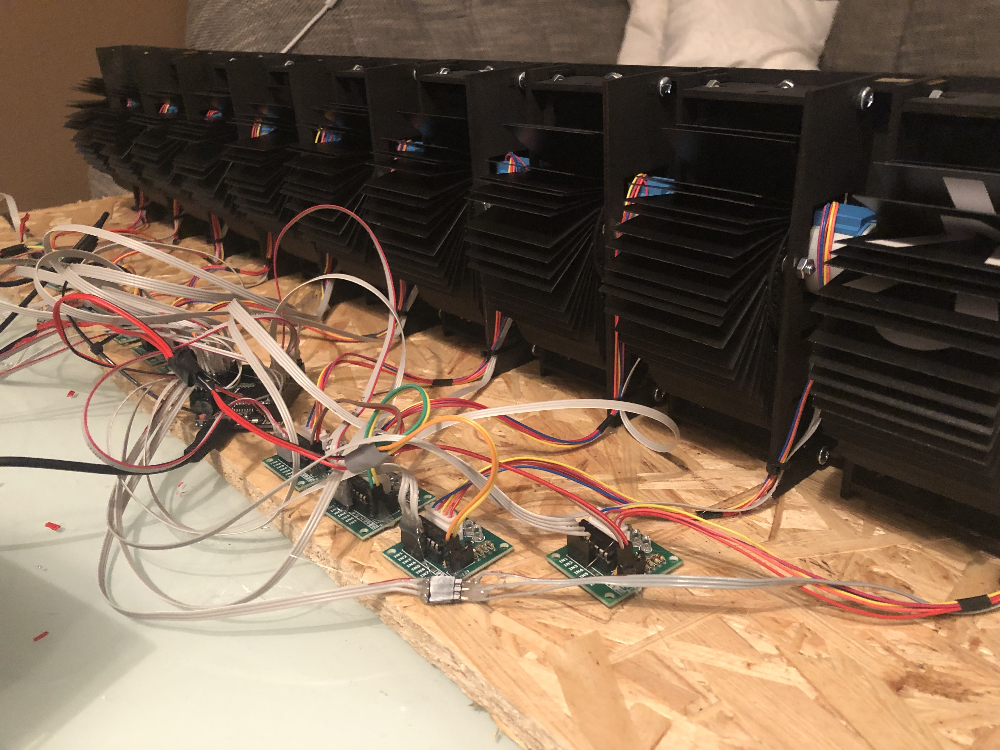

# DIY Split-Flap Display - Work In Progress!

### SplitFlap Display based on the [scottbez1/splitflap](https://github.com/scottbez1/splitflap) project

Modifications:
- **45 flaps** :  ` `, `A-Z`, `0-9`, `Ä`, `Ö`, `Ü`, `ß`, `,` , `.`, `!`, `?` _(40 flaps on the original)_
- laser-cuttable [propylen cover sheets](https://www.ebay.de/itm/390361527869) as flaps
- uses the ULN2003 driver delivered with the [28byj-48 stepper motors](https://www.amazon.de/gp/product/B07VGV1XFT)
- controlling **10 displays with one single [Mega2560 PRO MINI](https://de.aliexpress.com/item/32966042485.html) board** _(no custom pcb necessary)_
  - _next step will be an [Arduino Mega2560 with WiFi](https://de.aliexpress.com/item/33011577070.html) board_
- use [A3144 hall sensors](https://www.ebay.de/itm/182592276084)

### construction site pictures ^^ 

